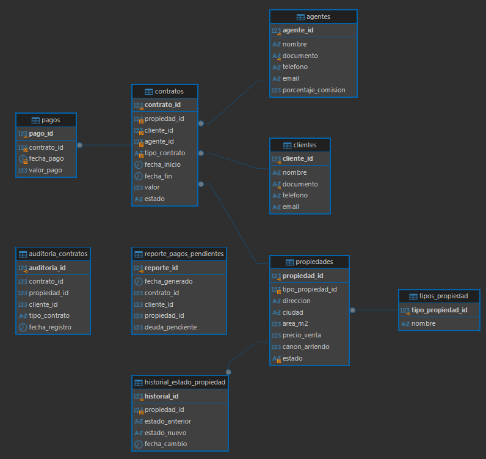

# Sistema de Gestión Inmobiliaria

## Descripción

Este proyecto implementa un sistema de gestión inmobiliaria en MySQL para administrar propiedades, clientes, agentes inmobiliarios, contratos y pagos.

El sistema permite gestionar propiedades destinadas a venta o arriendo, registrar contratos, controlar pagos, calcular comisiones, identificar deudas pendientes, auditar cambios importantes y generar reportes periódicos.

Además, incluye mecanismos de seguridad mediante usuarios y privilegios diferenciados, funciones personalizadas, triggers, índices y un evento programado.

---

## Objetivo

Construir una base de datos robusta, organizada y segura que pueda funcionar como prototipo de un sistema real de gestión inmobiliaria.

El sistema busca facilitar:

- La administración del portafolio de propiedades.
- El registro de clientes y agentes.
- La gestión de contratos de venta y arriendo.
- El control del historial de pagos.
- El cálculo de comisiones.
- El cálculo de deudas pendientes.
- La auditoría de cambios.
- La generación automática de reportes.
- La aplicación de privilegios según el tipo de usuario.

---

## Tecnologías utilizadas

- MySQL
- DBeaver
- Visual Studio Code
- Git
- GitHub

---

## Estructura del proyecto

```text
sistema_gestion_inmobiliaria/
│
├── docs/
│   └── mer_inmobiliaria.png
│
├── sql/
│   ├── 01_ddl.sql
│   ├── 02_dml.sql
│   ├── 03_funciones.sql
│   ├── 04_triggers.sql
│   ├── 05_seguridad.sql
│   ├── 06_indices_eventos.sql
│   └── 07_pruebas.sql
│
├── .gitignore
└── README.md
```

---

## Modelo Entidad-Relación

El modelo de datos está compuesto por las siguientes entidades principales:

- `tipos_propiedad`
- `propiedades`
- `clientes`
- `agentes`
- `contratos`
- `pagos`

También se incluyen tablas auxiliares para auditoría y reportes:

- `historial_estado_propiedad`
- `auditoria_contratos`
- `reporte_pagos_pendientes`

El diagrama entidad-relación se encuentra en:

```text
docs/mer_inmobiliaria.png
```



---

## Relaciones principales

Las relaciones principales del sistema son:

| Tabla principal | Relación | Tabla relacionada |
|---|---|---|
| `tipos_propiedad` | 1:N | `propiedades` |
| `propiedades` | 1:N | `contratos` |
| `clientes` | 1:N | `contratos` |
| `agentes` | 1:N | `contratos` |
| `contratos` | 1:N | `pagos` |
| `propiedades` | 1:N | `historial_estado_propiedad` |

Esto significa, por ejemplo, que un tipo de propiedad puede estar asociado a muchas propiedades, mientras que cada propiedad pertenece a un solo tipo.

De igual manera, un cliente puede tener varios contratos, un agente puede gestionar varios contratos y un contrato puede tener varios pagos.

---

## Normalización

El núcleo transaccional del sistema fue diseñado siguiendo los principios de normalización hasta Tercera Forma Normal.

### Primera Forma Normal - 1FN

Cada campo almacena valores atómicos y no existen grupos repetidos dentro de una misma columna.

Por ejemplo, los pagos no se almacenan dentro de un solo campo del contrato. Cada pago se registra como una fila independiente en la tabla `pagos`.

Ejemplo:

```text
pago_id | contrato_id | fecha_pago | valor_pago
1       | 1           | 2026-01-05 | 1400000
2       | 1           | 2026-02-05 | 1400000
```

---

### Segunda Forma Normal - 2FN

Todos los atributos dependen completamente de la clave primaria de su tabla.

Por ejemplo, en la tabla `pagos`, los campos:

```text
contrato_id
fecha_pago
valor_pago
```

dependen del identificador `pago_id`.

No se almacenan datos como el nombre del cliente o la dirección de la propiedad dentro de la tabla `pagos`, ya que esos datos pertenecen a otras entidades.

---

### Tercera Forma Normal - 3FN

Se evitan dependencias transitivas y duplicación innecesaria de información en las tablas principales.

Por ejemplo, en `contratos` se almacenan únicamente las claves necesarias:

```text
propiedad_id
cliente_id
agente_id
```

Los datos asociados, como el nombre del cliente, el nombre del agente o la dirección de la propiedad, se obtienen mediante relaciones y consultas `JOIN`.

También se separó la tabla `tipos_propiedad` para evitar repetir constantemente valores como:

```text
Casa
Apartamento
Local comercial
```

Las tablas de auditoría y reportes conservan ciertos datos de manera intencional para mantener trazabilidad e información histórica.

---

## Instalación

### 1. Requisitos

Para ejecutar el proyecto se recomienda tener instalado:

- MySQL Server.
- DBeaver o cualquier cliente compatible con MySQL.
- Visual Studio Code para visualizar y editar los archivos del repositorio.
- Git para control de versiones.

---

### 2. Crear conexión en DBeaver

Crear una conexión a MySQL utilizando un usuario con permisos suficientes para:

- Crear bases de datos.
- Crear tablas.
- Crear funciones.
- Crear triggers.
- Crear eventos.
- Crear usuarios.
- Asignar privilegios.

---

### 3. Ejecutar los scripts

Los archivos SQL deben ejecutarse en el siguiente orden:

```text
01_ddl.sql
02_dml.sql
03_funciones.sql
04_triggers.sql
05_seguridad.sql
06_indices_eventos.sql
07_pruebas.sql
```

La base de datos creada se llama:

```text
inmobiliaria
```

---

## Script DDL

El archivo:

```text
sql/01_ddl.sql
```

contiene la creación de la base de datos y de las tablas principales.

Las tablas creadas son:

```text
tipos_propiedad
propiedades
clientes
agentes
contratos
pagos
historial_estado_propiedad
auditoria_contratos
reporte_pagos_pendientes
```

También contiene las claves primarias y claves foráneas necesarias para mantener la integridad referencial.

---

## Script DML

El archivo:

```text
sql/02_dml.sql
```

contiene datos de prueba para validar el funcionamiento del sistema.

Se incluyen registros de:

- Tipos de propiedad.
- Agentes.
- Clientes.
- Propiedades.
- Contratos de arriendo.
- Contratos de venta.
- Pagos.

Los datos fueron diseñados para permitir la prueba de las funciones, triggers y eventos del sistema.

---

## Funciones personalizadas

Las funciones se encuentran en:

```text
sql/03_funciones.sql
```

Se implementaron tres funciones principales.

### Función `calcular_comision_venta`

Calcula la comisión correspondiente al agente asociado a un contrato de venta.

La función utiliza:

- El valor del contrato.
- El porcentaje de comisión del agente.

La fórmula utilizada es:

```text
comision = valor_venta * porcentaje_comision / 100
```

Ejemplo:

```sql
SELECT calcular_comision_venta(2) comision;
```

Si el contrato no existe, se genera un error con `SIGNAL`.

También se valida que el contrato corresponda a una venta.

---

### Función `calcular_deuda_arriendo`

Calcula la deuda pendiente de un contrato de arriendo.

La lógica utilizada es:

```text
deuda =
(meses transcurridos * valor mensual)
-
total pagado
```

La función utiliza:

```text
TIMESTAMPDIFF
SUM
IFNULL
DECLARE
SELECT INTO
SIGNAL
```

Ejemplo:

```sql
SELECT calcular_deuda_arriendo(1) deuda;
```

La función valida que:

- El contrato exista.
- El contrato corresponda a un arriendo.

---

### Función `total_propiedades_disponibles`

Devuelve la cantidad de propiedades disponibles según el tipo indicado.

Ejemplo:

```sql
SELECT total_propiedades_disponibles('Casa') total;
```

Otros ejemplos:

```sql
SELECT total_propiedades_disponibles('Apartamento') total;

SELECT total_propiedades_disponibles('Local comercial') total;
```

La función valida que el tipo de propiedad exista antes de realizar el conteo.

---

## Triggers

Los triggers se encuentran en:

```text
sql/04_triggers.sql
```

Se implementaron dos triggers.

### Trigger `trg_cambio_estado_propiedad`

Este trigger se ejecuta después de actualizar una propiedad.

Su objetivo es registrar automáticamente cuando cambia el estado de una propiedad.

Ejemplos de cambios:

```text
Disponible -> Arrendada
Disponible -> Vendida
Arrendada -> Disponible
```

El trigger utiliza:

```text
OLD.estado
NEW.estado
```

Cuando existe un cambio, se genera un registro en:

```text
historial_estado_propiedad
```

Ejemplo de prueba:

```sql
UPDATE propiedades
SET estado = 'Arrendada'
WHERE propiedad_id = 1;
```

Consulta del historial:

```sql
SELECT *
FROM historial_estado_propiedad;
```

---

### Trigger `trg_nuevo_contrato`

Se ejecuta automáticamente después de insertar un nuevo contrato.

Su objetivo es registrar la creación del contrato dentro de:

```text
auditoria_contratos
```

El trigger utiliza los valores:

```text
NEW.contrato_id
NEW.propiedad_id
NEW.cliente_id
NEW.tipo_contrato
```

De esta manera se conserva un registro histórico de los contratos creados.

---

## Seguridad y privilegios

La configuración de seguridad se encuentra en:

```text
sql/05_seguridad.sql
```

Se implementaron tres usuarios con diferentes niveles de acceso.

### Administrador

Usuario:

```text
admin_inmobiliaria
```

Tiene privilegios completos sobre la base de datos.

Ejemplo:

```sql
GRANT ALL PRIVILEGES
ON inmobiliaria.*
TO 'admin_inmobiliaria'@'localhost';
```

Este usuario puede administrar completamente el sistema.

---

### Agente inmobiliario

Usuario:

```text
agente_inmobiliaria
```

Puede:

- Consultar propiedades.
- Consultar tipos de propiedad.
- Consultar agentes.
- Consultar clientes.
- Registrar clientes.
- Actualizar clientes.
- Consultar contratos.
- Registrar contratos.
- Actualizar contratos.

No tiene privilegios generales de eliminación ni administración de pagos.

---

### Contador

Usuario:

```text
contador_inmobiliaria
```

Puede:

- Consultar clientes.
- Consultar propiedades.
- Consultar contratos.
- Consultar pagos.
- Registrar pagos.
- Actualizar pagos.
- Consultar reportes de pagos pendientes.

---

### Verificación de privilegios

Los permisos pueden consultarse con:

```sql
SHOW GRANTS
FOR 'admin_inmobiliaria'@'localhost';

SHOW GRANTS
FOR 'agente_inmobiliaria'@'localhost';

SHOW GRANTS
FOR 'contador_inmobiliaria'@'localhost';
```

---

## Optimización

La optimización se encuentra en:

```text
sql/06_indices_eventos.sql
```

Se crearon índices sobre columnas utilizadas frecuentemente en filtros y consultas.

Los índices creados son:

```text
idx_propiedades_estado
idx_contratos_tipo_estado
idx_pagos_fecha
```

---

### Índice de propiedades

```sql
CREATE INDEX idx_propiedades_estado
ON propiedades(estado);
```

Permite optimizar consultas como:

```sql
SELECT *
FROM propiedades
WHERE estado = 'Disponible';
```

---

### Índice de contratos

```sql
CREATE INDEX idx_contratos_tipo_estado
ON contratos(tipo_contrato, estado);
```

Facilita consultas que filtren contratos por tipo y estado.

Ejemplo:

```sql
SELECT *
FROM contratos
WHERE tipo_contrato = 'Arriendo'
AND estado = 'Activo';
```

---

### Índice de pagos

```sql
CREATE INDEX idx_pagos_fecha
ON pagos(fecha_pago);
```

Permite mejorar búsquedas y reportes relacionados con fechas de pago.

---

### Verificación de índices

```sql
SHOW INDEX FROM propiedades;

SHOW INDEX FROM contratos;

SHOW INDEX FROM pagos;
```

---

## Evento programado

El sistema incluye un evento llamado:

```text
ev_reporte_pagos_pendientes
```

Este evento se encuentra en:

```text
sql/06_indices_eventos.sql
```

Su objetivo es generar automáticamente un reporte mensual de los contratos de arriendo activos que tengan deuda pendiente.

El evento se ejecuta:

```text
EVERY 1 MONTH
```

Los resultados se almacenan en:

```text
reporte_pagos_pendientes
```

La lógica utilizada es:

```text
Contratos activos
        ↓
Tipo Arriendo
        ↓
Calcular deuda
        ↓
Deuda mayor que 0
        ↓
Insertar en reporte
```

---

### Event Scheduler

Para verificar si el programador de eventos de MySQL está activo:

```sql
SHOW VARIABLES LIKE 'event_scheduler';
```

Si está desactivado, un usuario con privilegios administrativos puede ejecutar:

```sql
SET GLOBAL event_scheduler = ON;
```

---

### Verificar eventos

```sql
SHOW EVENTS;
```

También se puede consultar la definición del evento:

```sql
SHOW CREATE EVENT ev_reporte_pagos_pendientes;
```

---

## Pruebas del sistema

Las pruebas se encuentran en:

```text
sql/07_pruebas.sql
```

Este archivo permite comprobar el funcionamiento de:

- Funciones.
- Triggers.
- Auditoría.
- Índices.
- Evento programado.
- Usuarios y privilegios.

---

## Ejemplos de consultas

### Consultar todas las propiedades disponibles

```sql
SELECT *
FROM propiedades
WHERE estado = 'Disponible';
```

---

### Consultar propiedades con su tipo

```sql
SELECT
    p.propiedad_id,
    tp.nombre tipo,
    p.direccion,
    p.ciudad,
    p.estado
FROM propiedades p
JOIN tipos_propiedad tp
    ON p.tipo_propiedad_id = tp.tipo_propiedad_id;
```

---

### Consultar contratos con cliente y agente

```sql
SELECT
    c.contrato_id,
    cl.nombre cliente,
    a.nombre agente,
    c.tipo_contrato,
    c.valor,
    c.estado
FROM contratos c
JOIN clientes cl
    ON c.cliente_id = cl.cliente_id
JOIN agentes a
    ON c.agente_id = a.agente_id;
```

---

### Consultar pagos de un contrato

```sql
SELECT *
FROM pagos
WHERE contrato_id = 1;
```

---

### Consultar historial de cambios de propiedades

```sql
SELECT *
FROM historial_estado_propiedad;
```

---

### Consultar auditoría de contratos

```sql
SELECT *
FROM auditoria_contratos;
```

---

### Consultar reporte de pagos pendientes

```sql
SELECT *
FROM reporte_pagos_pendientes;
```

---

## Orden de ejecución recomendado

Para instalar y probar correctamente el proyecto, se recomienda ejecutar los archivos en este orden:

```text
1. sql/01_ddl.sql
2. sql/02_dml.sql
3. sql/03_funciones.sql
4. sql/04_triggers.sql
5. sql/05_seguridad.sql
6. sql/06_indices_eventos.sql
7. sql/07_pruebas.sql
```

---

## Consideraciones importantes

- Los scripts deben ejecutarse sobre MySQL.
- La creación de usuarios requiere permisos administrativos.
- La activación del `event_scheduler` puede requerir permisos administrativos.
- El archivo `07_pruebas.sql` modifica algunos datos con el objetivo de validar triggers y reportes.
- Para una prueba completamente limpia se recomienda volver a ejecutar el proyecto desde `01_ddl.sql`.
- El script `01_ddl.sql` elimina y vuelve a crear la base de datos para permitir pruebas desde cero.
- Las tablas de auditoría y reporte conservan información histórica de forma intencional.

---

## Estado del proyecto

El sistema implementa los principales requisitos definidos para el proyecto:

- Modelo Entidad-Relación.
- Normalización hasta 3FN en el núcleo transaccional.
- Script DDL.
- Script DML.
- Funciones personalizadas.
- Triggers.
- Auditoría.
- Usuarios y privilegios diferenciados.
- Índices.
- Evento programado.
- Reporte de pagos pendientes.
- Pruebas funcionales.
- Documentación del proyecto.

---

## Autor

Proyecto académico desarrollado como práctica de gestión de bases de datos con MySQL.

**Autor:** Fabián Camilo Aguilera Rodríguez